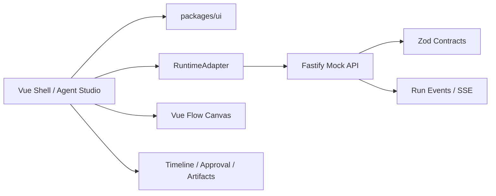

# Architecture

## Goal

Build a reusable front-end framework starter for Agent and operations products. The template separates the generic UI framework layer from Agent runtime concepts so later systems can choose a console-style surface, a task-session surface, or a hybrid surface without rewriting foundations.

## Workspace

```text
apps/web
apps/mock-api
packages/contracts
packages/ui
```

`packages/ui` owns design tokens and reusable Vue UI components. `packages/contracts` is the shared runtime boundary. Web and mock API import contracts from it instead of duplicating wire shapes.

## Runtime Flow



## Public Concepts

- Agent: named role, model hint, description, tool ownership.
- Tool: callable capability with risk level and input schema summary.
- Workflow: nodes and edges for input, Agent, tool, approval, and output.
- Run: one execution instance for a workflow and user input.
- RunEvent: ordered runtime event for timeline and canvas highlighting.
- HumanApproval: explicit pause point before risky work.
- Artifact: final or intermediate output.

## UI Framework Layer

- Design tokens: primary color, secondary color, text color, muted text, border, surface, state colors, spacing, radius, typography, and Element Plus variable aliases.
- Generic components: thin wrappers around mature Element Plus primitives plus layout shells that Element Plus does not provide directly for this project shape.
- App foundation: route meta and guard, auth store, permission helper/directive, typed env config, Axios request wrapper, and normalized API errors.
- Agent domain components: resource catalog, run timeline adapter, approval gate, artifact panel, and workflow canvas.
- Page composition: `apps/web` demonstrates how these pieces can produce a task-session view, a workflow configuration view, or an audit view.

## Mature Technology First

The starter should avoid rebuilding common UI and runtime capabilities. Use Element Plus for base UI, Vue Flow for workflow graphs, TanStack Vue Query and Axios for server state, Zod for validation, Fastify for the mock API, and framework adapters for runtime integration. Local packages should provide boundaries, tokens, and composition rather than a parallel component framework.

## Out Of Scope

- No real LLM calls.
- No real API keys.
- No storage layer beyond in-memory mock runtime.
- No generated code map files; use CodeGraph instead.
